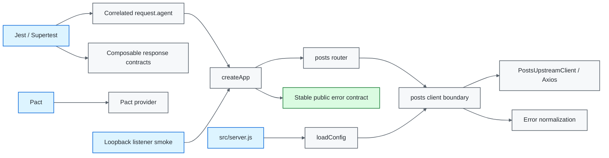

# Node.js / Supertest API Quality Engineering Framework

[](https://github.com/portyu9/qa-automation-node-supertest/actions/workflows/ci.yml)
[](https://github.com/portyu9/qa-automation-node-supertest/actions/workflows/extended.yml)
[](https://github.com/portyu9/qa-automation-node-supertest/actions/workflows/security.yml)
[](https://github.com/portyu9/qa-automation-node-supertest/actions/workflows/docs.yml)

[](https://nodejs.org/)
[](https://developer.mozilla.org/docs/Web/JavaScript)
[](https://expressjs.com/)
[](https://github.com/ladjs/supertest)
[](https://jestjs.io/)
[](https://docs.pact.io/)
[](https://github.com/features/actions)
[](https://trivy.dev/)
[](LICENSE)
[](.github/SECURITY.md)

A deterministic API quality-engineering framework built with **Express 5, Supertest, Jest, Axios, and Pact**. Fast component tests execute the real Express application in-process; external transport is isolated behind a provider-neutral client; Pact owns consumer compatibility; a separate loopback listener contract verifies real TCP/middleware/serialization behavior; and native Supertest agents/expectations remain available for stateful protocol contracts.

> [!IMPORTANT]
> Application behavior, in-process HTTP behavior, dependency transport behavior, contract compatibility, listener behavior, and deployed-environment behavior are different failure domains. The framework keeps those boundaries separate so a failing test answers **what broke** before it asks **where the stack trace ended**.

**Read by intent:** [capabilities](#capability-map) · [architecture](#architecture) · [quick start](#quick-start) · [native Supertest surface](#native-supertest-protocol-surface) · [failure taxonomy](#stable-public-failure-taxonomy) · [correlation](#request-correlation) · [dependencies](#dependency-maintenance) · [triage](#failure-triage)

## Capability map

| Plane | What it proves | Network model | Evidence |
| --- | --- | --- | --- |
| Component | Express routing, validation, middleware, error envelopes | In-process Supertest | Jest + coverage |
| Stateful protocol | Cookie persistence, query/body/header composition, redirects, HEAD/OPTIONS, reusable response contracts | `request.agent(app)` | Jest assertions |
| Transport | Target/timeout/error-normalization policy | Mocked Axios boundary | Jest assertions |
| Contract | Consumer/provider HTTP expectations | Pact mock provider | Pact artifacts |
| Listener | Real Node TCP + serialization + correlation | Ephemeral loopback + injected dependency | Local smoke summary |
| External integration | Real dependency behavior | Explicit `UPSTREAM_BASE_URL` | Separate environment signal |
| Security | Dependency/configuration exposure | Trivy filesystem scan | JSON + Markdown findings |
| Documentation | README/workflow/governance consistency | Repository-local validator | Actions status |

## Architecture



## Engineering invariants

| Concern | Framework contract |
| --- | --- |
| Fast API tests | `createApp({ postsClient })` + Supertest; no listener or external target required. |
| Stateful HTTP | `request.agent(app)` owns cookies across related in-process requests; tests opt into state explicitly. |
| Dependency isolation | Routes consume a narrow injected client, never Axios directly. |
| Runtime target | `UPSTREAM_BASE_URL` is required for real server startup; no public fallback exists. |
| Transport policy | One provider-neutral client validates target/timeout and normalizes transport failure. |
| Failure taxonomy | Timeout → `504/upstream_timeout`; unavailable/reset → `502/upstream_unavailable`. |
| Input validation | Invalid identifiers fail before the dependency boundary is called. |
| Correlation | Framework test requests receive bounded per-request correlation without obscuring native Supertest chaining. |
| Response policy | Reusable `.expect(fn)` helpers validate JSON/header/body contracts without replacing native `.expect()`. |
| Listener coverage | Real socket behavior is tested on `127.0.0.1:0` with a deterministic injected dependency. |
| Logging | Shared diagnostics use safe metadata, not request bodies/auth values. |
| Reproducibility | Node 22/24, committed lockfile, `npm ci`. |

## Boundary decision guide

| Requirement | Cheapest sufficient boundary |
| --- | --- |
| Route validation/error envelope | Supertest component test |
| Cookie/session behavior | Persistent Supertest agent |
| Query/body/header/redirect/verb behavior | Native Supertest chain |
| Client timeout/status/error mapping | Transport unit test |
| Provider interaction compatibility | Pact |
| Node listener/socket/serialization | Loopback listener smoke |
| Real dependency/environment | Explicit integration run |

> [!TIP]
> “End to end” is not a quality level. Use the boundary that introduces exactly the semantics the requirement depends on—and no more unrelated failure causes.

## Repository map

```text
.
├── src/
│   ├── app.js
│   ├── server.js
│   ├── config.js
│   ├── clients/{postsUpstreamClient.js,upstreamError.js}
│   ├── contracts/
│   ├── middleware/
│   ├── routes/
│   ├── testing/{apiAgent.js,expectations.js}
│   └── tests/supertestCapabilities.test.js
├── scripts/live-smoke.js
├── docs/{ARCHITECTURE.md,DEPENDENCY_BOUNDARIES.md,TEST_STRATEGY.md}
├── .github/workflows/{ci,docs,extended,security}.yml
├── jest.config.js
├── package.json
└── package-lock.json
```

## Quick start

```bash
npm ci
npm run check
npm run test:coverage
python .github/scripts/validate_readme.py
```

Exercise the real listener boundary without an external dependency:

```bash
npm run test:live-smoke
```

Start the real service only with an explicitly approved upstream:

```bash
UPSTREAM_BASE_URL=https://api.test.example.internal npm start
```

> [!NOTE]
> Ordinary component tests should not start `src/server.js`. Listener lifecycle and upstream availability are separate concerns and are tested separately.

<details>
<summary><strong>Command reference</strong></summary>

| Command | Purpose |
| --- | --- |
| `npm run check` | Syntax-check execution boundaries. |
| `npm test` | Complete Jest suite. |
| `npm run test:api` | Component/transport/framework tests, including native Supertest protocol contracts. |
| `npm run test:contract` | Pact consumer contracts. |
| `npm run test:coverage` | Full Jest suite with thresholds. |
| `npm run test:live-smoke` | Real loopback TCP listener with injected dependency. |
| `npm start` | Intentional runtime listener; requires explicit upstream. |

</details>

## Runtime configuration

| Variable | Purpose | Default |
| --- | --- | --- |
| `PORT` | Real listener port | `3000` |
| `UPSTREAM_BASE_URL` | Approved posts dependency | required |
| `REQUEST_TIMEOUT_MS` | Axios timeout | `8000` |
| `TEST_RUN_ID` | Correlation prefix | generated UUID |

`loadConfig(env)` accepts an injected environment map for tests and defaults to `process.env` only at the runtime edge. Missing/unsafe URLs, invalid ports, and invalid timeout budgets are configuration errors—not retry candidates.

## Native Supertest protocol surface

`src/testing/apiAgent.js` builds on `request.agent(app)`, preserving Supertest's fluent request object while adding one stable framework concern: a unique `x-request-id` derived from the run identity. It exposes common verbs plus generic dispatch without creating a second HTTP DSL.

`src/testing/expectations.js` supplies composable response functions for JSON content type, exact/regex headers, and arbitrary body predicates. They plug directly into native `.expect(fn)` chains.

`src/tests/supertestCapabilities.test.js` proves the pieces compose:

- an agent receives an HTTP-only session cookie and replays it on the next in-process request;
- `.query()` and `.send()` remain native and can be asserted together with headers/body contracts;
- request correlation is visible as ordinary HTTP behavior;
- redirect following uses Supertest's native `.redirects()` support;
- `HEAD` and `OPTIONS` are exercised alongside normal REST verbs;
- reusable expectation functions augment—not replace—status/header/body assertions.

Stateful agents should be created for the smallest scenario that requires state. A global shared agent would turn order dependence into hidden infrastructure.

## Stable public failure taxonomy

| Failure class | HTTP | Public `error` | Ownership |
| --- | ---: | --- | --- |
| Invalid post identifier | 400 | `invalid_post_id` | Input |
| Route missing | 404 | `not_found` | Routing |
| Dependency timeout | 504 | `upstream_timeout` | Upstream latency/transport |
| Dependency unavailable/reset | 502 | `upstream_unavailable` | Upstream availability/transport |
| Unknown application failure | 500 | `internal_server_error` | Application/unknown |

The public vocabulary is intentionally independent of Axios exception messages. Transport libraries may change without silently redefining the API contract.

## Request correlation

`requestContext` preserves inbound `x-request-id` only when it matches `[A-Za-z0-9._:-]{1,128}`. Invalid/oversized values are replaced before they can be reflected into headers, envelopes, or shared diagnostics. The test-side `apiAgent` independently generates bounded correlation values for protocol contracts.

```text
TEST_RUN_ID
└── request ID
    ├── response x-request-id
    ├── error envelope requestId
    └── diagnostic metadata
```

Correlation identifies a request; it must not become a carrier for credentials or business payloads.

## Deterministic listener and contract testing

`scripts/live-smoke.js` binds the real application to an ephemeral loopback port, injects a deterministic client, verifies health/posts/validation and request-ID propagation, then closes the listener. No DNS, TLS, runtime upstream configuration, or public service is involved.

Pact remains a distinct compatibility plane. A Pact failure is provider/consumer contract drift—not a reason to weaken component assertions or add retries.

## Evidence and security

Shared error diagnostics deliberately retain only bounded metadata such as request ID, public error code/status, and error class. Authorization values, cookies, request bodies, upstream bodies, and raw Axios configuration are excluded.

`security.yml` runs Trivy as an independent repository gate. Security failures are not application-test flakiness and must not be “fixed” by retries or coverage exclusions.

## Dependency maintenance

Dependabot maintains **npm** and **GitHub Actions**.

- weekly Monday 09:00 America/New_York;
- grouped minor/patch updates for manageable review volume;
- standalone majors for attributable Express/Jest/Axios/Pact/Node compatibility review;
- Actions treated as executable supply-chain dependencies;
- every dependency PR must clear component, contract, listener, security, and documentation gates as applicable.

Automation proposes a change; test evidence and release-impact review decide whether it is safe.

## Failure triage

| Signal | First interpretation |
| --- | --- |
| Component failure | Express/application contract |
| Agent/cookie mismatch | Stateful in-process HTTP contract |
| Query/body/header/redirect mismatch | Supertest protocol composition |
| Transport unit failure | Client policy/error normalization |
| Pact failure | Consumer/provider compatibility |
| Listener-only failure | TCP/runtime/serialization lifecycle |
| `502` / `504` contract mismatch | Dependency failure semantics |
| External-target-only failure | Environment/dependency integration |
| Security/docs | Independent repository governance |

## Explicit anti-patterns

- starting a real listener for every Supertest case;
- global/shared `request.agent()` state across unrelated tests;
- wrapping Supertest until native request/response semantics disappear;
- routes importing Axios directly;
- public provider defaults;
- leaking Axios error strings into public error contracts;
- broad retries around application assertions;
- unbounded caller-controlled correlation IDs;
- request/auth/upstream payloads in global logs;
- interpreting Pact as a replacement for component behavior tests.

## Design references

- [`docs/ARCHITECTURE.md`](docs/ARCHITECTURE.md) — application, transport, listener, and evidence boundaries.
- [`docs/DEPENDENCY_BOUNDARIES.md`](docs/DEPENDENCY_BOUNDARIES.md) — dependency ownership and failure normalization.
- [`docs/TEST_STRATEGY.md`](docs/TEST_STRATEGY.md) — layer selection and exit criteria.

A strong Supertest framework makes the failed boundary obvious: **application behavior, stateful in-process HTTP semantics, input policy, transport normalization, compatibility, listener runtime, or explicit external dependency**.
