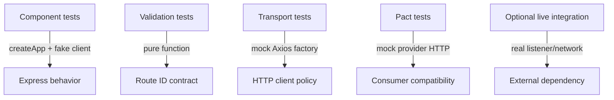
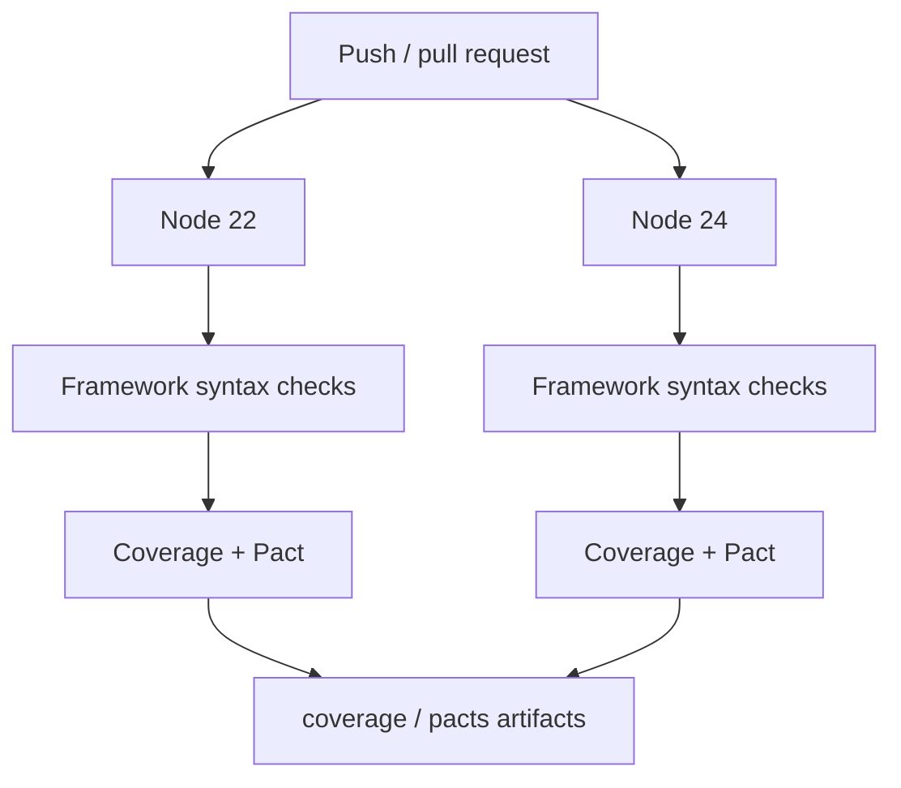

# Node.js / Supertest API Automation Framework

A deterministic Node.js API test framework built with Express, Supertest, Jest, Axios, and Pact. Fast component tests exercise the Express application in-process without opening a TCP listener. External HTTP behavior is isolated behind a client boundary, transport failures are normalized into stable dependency contracts, and consumer contract tests remain separate from implementation tests.

## Engineering contract

| Concern | Framework policy |
| --- | --- |
| Fast API tests | Import the Express app and use Supertest directly; no server process is required. |
| Dependency isolation | Routes receive an injected posts client, allowing deterministic success/failure simulation. |
| Transport policy | Axios base URL and timeout are configured in one client boundary. |
| Dependency failures | Timeouts map to `504/upstream_timeout`; other upstream transport failures map to `502/upstream_unavailable`. |
| Application failures | Unexpected faults remain `500/internal_server_error`; dependency outages are not mislabeled as application defects. |
| Correlation | Every request has an `x-request-id` and stable JSON error envelopes carry the same identifier. |
| Contract testing | Pact verifies the consumer-facing HTTP boundary independently from Express component tests. |
| Evidence | Coverage and generated Pact artifacts are retained by CI; logs contain stable diagnostic fields rather than request bodies. |
| Reproducibility | Node 22/24, committed lockfile, `npm ci`, and lockfile-backed caching define the supported CI graph. |

## Architecture

```mermaid
flowchart LR
    T[Jest / Supertest] --> APP[Express createApp]
    APP --> ROUTE[/posts router]
    ROUTE --> PORT[posts client interface]
    PORT --> HTTP[JsonPlaceholderClient]
    HTTP --> AXIOS[Axios transport]

    T -. injected fake .-> PORT
    CONTRACT[Pact consumer test] --> HTTP

    HTTP --> ERR[Upstream error normalization]
    ERR --> APPERR[Express error middleware]
    APPERR --> ENVELOPE[Stable JSON error contract]
```

The critical boundary is the client interface consumed by the router. Component tests replace that boundary with deterministic doubles; transport tests verify Axios configuration/error normalization; Pact verifies HTTP compatibility. Each layer answers a different question.

## Repository layout

```text
.
├── src/
│   ├── app.js
│   ├── server.js
│   ├── config.js
│   ├── clients/
│   │   ├── jsonPlaceholderClient.js
│   │   └── upstreamError.js
│   ├── contracts/
│   ├── middleware/
│   ├── routes/
│   ├── testing/
│   └── tests/
├── postman/
├── docs/
│   ├── ARCHITECTURE.md
│   ├── DEPENDENCY_BOUNDARIES.md
│   └── TEST_STRATEGY.md
├── jest.config.js
├── package.json
└── package-lock.json
```

## Quick start

Node.js 22+ is required.

```bash
npm ci
npm run check
npm run test:coverage
```

Start the sample service only when an actual listener is needed:

```bash
npm start
```

Fast Supertest tests should not start that process.

## Commands

| Command | Purpose |
| --- | --- |
| `npm run check` | Syntax-check every framework execution boundary. |
| `npm test` | Run the complete Jest suite serially. |
| `npm run test:api` | Run component/transport/framework tests under `src/tests`. |
| `npm run test:contract` | Run Pact consumer contract tests. |
| `npm run test:coverage` | Run the full suite with configured Jest coverage thresholds. |
| `npm start` | Start the Express listener for intentional live integration/manual use. |

`npm ci` is the normal installation path. Use `npm install` only when intentionally changing dependencies and commit the resulting lockfile update with the manifest change.

## Runtime configuration

| Variable | Purpose | Default |
| --- | --- | --- |
| `PORT` | Listener port when `src/server.js` is started | `3000` |
| `UPSTREAM_BASE_URL` | Posts dependency endpoint | JSONPlaceholder |
| `REQUEST_TIMEOUT_MS` | Axios upstream timeout budget | `8000` |
| `TEST_RUN_ID` | Request-correlation prefix | generated UUID |

Configuration is validated before server startup. Invalid ports, URLs, and timeout budgets fail as configuration errors rather than surfacing as later request failures.

## Test topology



### Component tests

Component tests use:

```js
const { createApp } = require('../app');
const { apiAgent } = require('../testing/apiAgent');

const app = createApp({ postsClient: deterministicDouble, config });
await apiAgent(app).get('/posts').expect(200);
```

Supertest invokes the Express application directly. This keeps the fast layer independent of TCP port availability, DNS, TLS, public-service rate limits, and external data changes.

### Transport tests

`jsonPlaceholderClient.test.js` verifies that the Axios boundary receives the configured base URL and timeout and that network error codes are translated into framework-owned dependency errors.

### Contract tests

Pact verifies whether the consumer's expected HTTP interaction remains compatible with the provider contract. A component test proving route behavior does not replace a consumer/provider compatibility test, and a Pact test does not replace route validation.

## Stable error taxonomy

The application has an explicit public failure vocabulary:

| Failure class | HTTP | JSON `error` | Ownership |
| --- | ---: | --- | --- |
| Invalid route identifier | 400 | `invalid_post_id` | Request/client input |
| Route not found | 404 | `not_found` | Application routing |
| Upstream timeout | 504 | `upstream_timeout` | Dependency/transport |
| Upstream unavailable/reset/other transport failure | 502 | `upstream_unavailable` | Dependency/transport |
| Unexpected application error | 500 | `internal_server_error` | Application defect/unknown |

Every error envelope also includes `requestId`.

The taxonomy is deliberately independent of Axios-specific exception text. If the HTTP library changes later, public behavior can remain stable.

## Request correlation

`requestContext` creates or propagates a request ID and returns it through the `x-request-id` response header. `apiAgent()` generates run-scoped request IDs for tests while preserving Supertest's fluent API.

Correlation IDs answer: **which request failed?** They should not contain credentials or business payloads.

## Logging policy

Generic middleware logs only stable diagnostic fields:

```text
requestId
error class
public error code
HTTP status
```

It intentionally excludes:

- authorization headers;
- cookies;
- request bodies;
- upstream response bodies;
- secrets/tokens;
- raw Axios configuration objects.

Endpoint-specific tests may inspect payloads as assertions, but automatic framework logs should be safe by default.

## Coverage policy

Jest coverage thresholds are a regression detector, not a quality score. Important behaviors include:

- successful list/item routes;
- invalid identifiers before the dependency boundary;
- request correlation;
- timeout configuration;
- timeout vs unavailable normalization;
- stable dependency error envelopes;
- unexpected-error fallback;
- consumer contract compatibility.

A line executed without a meaningful assertion is not strong coverage.

## CI topology



CI uses `npm ci`, the committed `package-lock.json`, lockfile-backed npm caching, read-only repository permissions, and bounded artifact retention.

## Failure triage

Classify the boundary first:

1. **400 validation failure** — inspect the route input contract; the upstream client should not have been called.
2. **502 dependency unavailable** — inspect dependency connectivity/transport, not Express business logic first.
3. **504 dependency timeout** — inspect the timeout budget and upstream latency; do not blindly increase the timeout.
4. **500 internal error** — inspect application code/double configuration; this path intentionally excludes recognized dependency faults.
5. **Pact failure** — consumer/provider compatibility changed; do not rewrite the component test to conceal it.
6. **Coverage failure** — identify the missing behavior path rather than excluding code for convenience.

## Extension rules

When adding an external dependency:

1. define a narrow client interface consumed by the route/service layer;
2. centralize transport configuration in the concrete client;
3. normalize library-specific failures at that boundary;
4. inject deterministic doubles into component tests;
5. add transport contract tests for timeout/base URL/error classification;
6. add consumer contract verification when independent deployment compatibility matters;
7. keep live-network tests explicit and separate from the fast pull-request path.

When adding application endpoints:

- validate identifiers/input before the dependency boundary;
- keep stable public error codes;
- include request correlation in error responses;
- do not leak dependency exception text to callers;
- keep route tests deterministic.

## Anti-patterns

The framework intentionally avoids:

- starting an HTTP listener for every Supertest test;
- public-network calls in component tests;
- mocking Axios from route tests instead of replacing the client boundary;
- retrying mutating requests blindly;
- returning raw dependency exceptions to API consumers;
- treating all dependency failures as application `500`s;
- generic API wrappers that hide Supertest assertions;
- request-body logging in global error middleware;
- coverage percentages used as a substitute for behavioral contracts.

## Further design documentation

- [`docs/ARCHITECTURE.md`](docs/ARCHITECTURE.md) — Express, client, and test-layer boundaries.
- [`docs/DEPENDENCY_BOUNDARIES.md`](docs/DEPENDENCY_BOUNDARIES.md) — deterministic doubles, transport tests, Pact, and live integration responsibilities.
- [`docs/TEST_STRATEGY.md`](docs/TEST_STRATEGY.md) — layer selection, negative testing, and release-gate policy.

The framework is designed so a failed request can be classified as **input**, **application**, **dependency availability**, **dependency latency**, or **contract compatibility** without relying on an external service to reproduce the failure.
