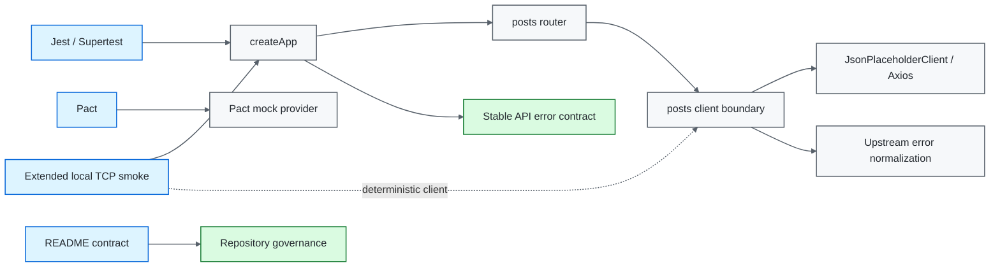
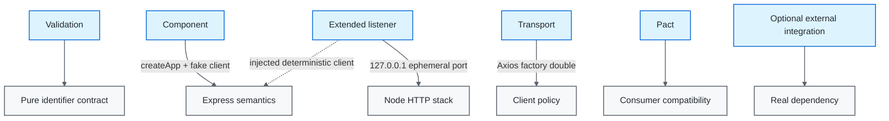
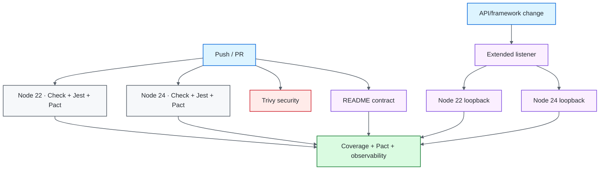

# Node.js / Supertest API Quality Engineering Framework

[](https://github.com/portyu9/qa-automation-node-supertest/actions/workflows/ci.yml)
[](https://github.com/portyu9/qa-automation-node-supertest/actions/workflows/extended.yml)
[](https://github.com/portyu9/qa-automation-node-supertest/actions/workflows/security.yml)
[](https://github.com/portyu9/qa-automation-node-supertest/actions/workflows/docs.yml)

[](https://nodejs.org/)
[](https://developer.mozilla.org/docs/Web/JavaScript)
[](https://expressjs.com/)
[](https://github.com/ladjs/supertest)
[](https://jestjs.io/)
[](https://docs.pact.io/)
[](https://github.com/features/actions)
[](https://trivy.dev/)
[](LICENSE)
[](.github/SECURITY.md)

A deterministic API quality-engineering framework built with **Express 5**, **Supertest**, **Jest**, **Axios**, and **Pact**. The fast layer exercises the Express application in-process, external transport is isolated behind a client boundary, dependency failures are normalized into stable public semantics, and an extended local-listener contract validates the real TCP/middleware/serialization path without introducing public-network nondeterminism.

> [!IMPORTANT]
> The framework separates **application behavior**, **transport behavior**, **consumer compatibility**, **listener/runtime behavior**, and **documentation governance**. Those are distinct failure domains and should stay distinct in both test design and triage.

## Capability map

| Validation plane | What it proves | Network model | Evidence |
| --- | --- | --- | --- |
| Component | Express routing, validation, middleware, stable error envelopes | In-process Supertest | Jest assertions + coverage |
| Transport | Axios configuration and failure normalization | Mocked client factory | Jest assertions |
| Contract | Consumer/provider HTTP expectations | Pact mock provider | Pact artifacts |
| Extended listener | Real Node TCP listener + serialization/correlation | `127.0.0.1:0`, injected deterministic dependency | Local smoke summary |
| Security | Dependency/configuration exposure | Filesystem analysis | Trivy JSON + Markdown summary |
| Documentation contract | README links, workflow badges, Mermaid declarations, governance surfaces, badge palette | Repository-local Python stdlib validation | Actions status |
| Observability | Run identity and runtime dimension | Structured CI metadata | `reports/ci-observability-*.json` + Actions summary |



## Engineering invariants

| Concern | Framework contract |
| --- | --- |
| Fast API tests | Import `createApp()` and use Supertest directly; no listener process is required. |
| Dependency isolation | Routes consume a narrow injected client, not Axios directly. |
| Transport policy | Base URL and timeout exist in one concrete client boundary. |
| Failure taxonomy | Timeout → `504/upstream_timeout`; other transport outage/reset → `502/upstream_unavailable`. |
| Application faults | Unknown defects remain `500/internal_server_error`. |
| Input validation | Invalid identifiers fail before the dependency boundary is called. |
| Correlation | Safe inbound request IDs are preserved; malformed or oversized IDs are replaced before they are reflected into headers, envelopes, or diagnostics. |
| Listener coverage | Real socket behavior is tested locally with an ephemeral loopback listener and injected dependency. |
| Logging | Global diagnostics use stable metadata and exclude request bodies/auth values. |
| Reproducibility | Node 22/24 + committed lockfile + `npm ci`. |
| Documentation | README-local references, workflow badges, Mermaid roots, governance files, and static badge-color uniqueness are executable contracts. |

## Tool ownership model

| Tool / technology | Native responsibility | Framework responsibility | Deliberately left visible |
| --- | --- | --- | --- |
| Express | Routing, middleware execution, request/response lifecycle, listener integration | Application composition, validation middleware, stable public error envelope, dependency injection | Express request/response semantics and middleware ordering |
| Supertest | In-process HTTP-style requests against the Express application | Fast component boundary and run-scoped request-agent correlation | Native fluent assertions and application-without-listener execution |
| Jest | Test lifecycle, assertions, mocks, coverage collection | Component/transport/framework grouping and deterministic doubles | Jest assertion/stack and mock semantics |
| Axios | Concrete upstream transport, timeout/error objects | One client boundary, validated base URL/timeout, transport error normalization | Axios-specific errors terminate at the client boundary rather than leaking into public API semantics |
| Pact | Consumer interaction recording and mock-provider verification | Compatibility plane separate from component behavior | Pact interaction failures remain compatibility evidence, not component failures |
| Node HTTP / `fetch` | Real listener/socket/serialization behavior | Loopback-only extended smoke with injected deterministic dependency | TCP/listener failures remain runtime signals rather than upstream availability noise |
| Trivy | Filesystem vulnerability and supported misconfiguration analysis | HIGH/CRITICAL remediation-oriented gate and retained findings | Configured `vuln,misconfig` scan is not generic credential/secret scanning |
| GitHub Actions | Job/runtime isolation and artifact transport | Node matrix, listener extension, security/docs separation, observability envelope | Native job/process exit state remains authoritative |

## Repository map

```text
.
├── src/
│   ├── app.js
│   ├── server.js
│   ├── config.js
│   ├── clients/
│   ├── contracts/
│   ├── middleware/
│   ├── routes/
│   ├── testing/
│   └── tests/
├── scripts/
│   └── live-smoke.js
├── postman/
├── docs/
│   ├── ARCHITECTURE.md
│   ├── DEPENDENCY_BOUNDARIES.md
│   └── TEST_STRATEGY.md
├── .github/
│   ├── scripts/
│   │   └── validate_readme.py
│   └── workflows/
│       ├── ci.yml
│       ├── docs.yml
│       ├── extended.yml
│       └── security.yml
├── jest.config.js
├── package.json
└── package-lock.json
```

## Documentation contract

`.github/workflows/docs.yml` runs a zero-third-party-dependency repository validator on every pull request and `main`. It verifies deterministic local facts: local Markdown targets exist and remain inside the repository, workflow badges reference committed workflows, Mermaid blocks start with recognized declarations, `LICENSE` and `.github/SECURITY.md` remain present, static Shields colors are unique within this README, and Security Policy remains GitHub-dark `#24292F`.

External website availability is intentionally excluded. An upstream documentation outage is not an Express/Supertest framework defect.

## Quick start

Node.js 22+ is required.

```bash
npm ci
npm run check
npm run test:coverage
python .github/scripts/validate_readme.py
```

Exercise the deterministic real-listener boundary:

```bash
npm run test:live-smoke
```

Start the application with its configured concrete dependency only when a real external-listener execution is intentionally required:

```bash
npm start
```

> [!NOTE]
> The ordinary Supertest suite should not start `src/server.js`. A real listener is more expensive and adds socket lifecycle concerns; those concerns are tested explicitly by the separate local listener contract.

<details>
<summary><strong>Command reference</strong></summary>

| Command | Purpose |
| --- | --- |
| `npm run check` | Syntax-check framework execution boundaries and the listener smoke utility. |
| `npm test` | Complete Jest suite. |
| `npm run test:api` | Component/transport/framework tests. |
| `npm run test:contract` | Pact consumer contract tests. |
| `npm run test:coverage` | Full Jest suite with coverage thresholds. |
| `npm run test:live-smoke` | Real loopback TCP listener with deterministic injected client. |
| `npm start` | Intentional service listener using runtime configuration. |

</details>

## Runtime configuration

| Variable | Purpose | Default |
| --- | --- | --- |
| `PORT` | Listener port for `src/server.js` | `3000` |
| `UPSTREAM_BASE_URL` | Concrete posts dependency | JSONPlaceholder |
| `REQUEST_TIMEOUT_MS` | Axios upstream timeout | `8000` |
| `TEST_RUN_ID` | Test/request correlation prefix | generated UUID |

Configuration is validated before listener startup. Invalid ports, unsafe URLs, and invalid timeout budgets are framework errors, not request-retry candidates.

## Boundary topology



A test should use the cheapest boundary that proves the requirement. Do not promote a deterministic component case to a live-network test merely to make it look more end-to-end.

## Stable public failure taxonomy

| Failure class | HTTP | Public `error` | Ownership |
| --- | ---: | --- | --- |
| Invalid post identifier | 400 | `invalid_post_id` | Request/input |
| Route missing | 404 | `not_found` | Application routing |
| Dependency timeout | 504 | `upstream_timeout` | Upstream latency/transport |
| Dependency unavailable/reset | 502 | `upstream_unavailable` | Upstream availability/transport |
| Unknown application failure | 500 | `internal_server_error` | Application/unknown |

Every stable error envelope includes `requestId`.

The public vocabulary is intentionally independent of Axios exception messages. Transport libraries may change; the API contract should not change accidentally with them.

## Request correlation

`requestContext` accepts an incoming `x-request-id` only when it matches the bounded token contract `[A-Za-z0-9._:-]{1,128}`. Valid caller-provided IDs are preserved. Empty, malformed, or oversized values are replaced with a generated UUID **before** the identifier is reflected into the response header, stable error envelope, or shared diagnostics. `apiAgent()` generates run-scoped IDs for Supertest tests while retaining Supertest's fluent interface.

```text
TEST_RUN_ID
└── bounded request ID
    ├── response x-request-id
    ├── error envelope requestId
    └── diagnostic log fields
```

Correlation identifies **which request** failed. It is bounded metadata, not a carrier for credentials, path fragments, or business payloads.

## Deterministic real-listener contract

`scripts/live-smoke.js` deliberately covers what in-process Supertest does not:

1. builds the real Express application;
2. injects a deterministic posts client;
3. binds to `127.0.0.1` on port `0` so the OS chooses an ephemeral port;
4. exercises `/health`, `/posts/42`, and an invalid-ID route through native Node `fetch`;
5. verifies HTTP serialization and request-ID propagation;
6. closes the listener deterministically.

No public DNS, TLS, or upstream service is involved. This isolates Node listener/middleware/runtime regressions from dependency availability.

## Contract testing

Pact remains a separate responsibility. Component tests prove how this application behaves with a client contract. Pact proves the consumer interaction expected from an independently deployable provider.

A Pact failure should be handled as compatibility drift—not concealed by weakening a component assertion.

## Logging and diagnostic policy

Global error diagnostics are intentionally narrow:

```text
requestId
error class
public error code
HTTP status
```

They exclude authorization values, cookies, request bodies, upstream response bodies, and raw Axios configuration. Tests can assert payloads explicitly; shared framework logs should remain safe by default.

## Security engineering

`.github/workflows/security.yml` uses open-source Trivy filesystem scanning with an immutable action commit (`ed142fd0673e97e23eac54620cfb913e5ce36c25`, `v0.36.0`) and engine `v0.74.0`.

The gate is configured for fixed HIGH/CRITICAL dependency vulnerabilities and HIGH/CRITICAL supported repository/configuration misconfigurations. Findings are preserved as JSON plus a compact Markdown summary. Its configured scanners are `vuln,misconfig`; this repository does not claim that workflow as generic credential/secret scanning.

> [!WARNING]
> Security findings are not application-test flakiness. Do not add retries, modify HTTP timeout policy, or exclude code from coverage to make a security gate green.

## Observability model

Primary Node 22/24 jobs emit:

```text
reports/
├── ci-observability-node-22.json
├── ci-observability-node-24.json
└── ci-summary-node-<version>.md
```

Each JSON envelope contains framework identity, `TEST_RUN_ID`, Node dimension, final job status, commit SHA, and ref. Coverage and Pact artifacts remain the detailed machine evidence; the observability envelope supplies a stable run-level index that can later be consumed by open-source telemetry/log tooling.

Extended listener jobs also publish an Actions summary that explicitly records:

- loopback/ephemeral transport;
- deterministic injected upstream;
- Node runtime;
- gate status;
- the boundary the smoke is intended to prove.

## CI topology



## Failure triage

| Signal | First interpretation | Correct first move |
| --- | --- | --- |
| 400 contract failure | Input validation | Verify route parser and ensure dependency was not called |
| 502 | Dependency availability | Inspect concrete transport/connectivity |
| 504 | Dependency latency | Inspect timeout/latency; do not blindly increase timeout |
| 500 | Application/unknown | Inspect application exception path |
| Unsafe request ID replaced | Correlation/input metadata | Verify caller-generated correlation format rather than disabling validation |
| Pact failure | Compatibility | Compare consumer interaction/provider contract |
| Listener smoke failure | Node listener/middleware/runtime | Reproduce locally; dependency is deterministic |
| Node-version-only failure | Runtime compatibility | Compare runtime behavior before changing API semantics |
| Coverage gate | Missing exercised behavior | Add meaningful assertions, not exclusions |
| README contract | Documentation/governance drift | Fix local target, workflow badge, Mermaid declaration, governance surface, or palette collision |
| Trivy gate | Dependency/configuration risk | Triage exact finding/remediation |

## Extension rules

When adding a dependency:

1. define a narrow interface consumed by route/service code;
2. centralize concrete transport policy;
3. normalize library-specific errors at the client boundary;
4. inject deterministic doubles in component tests;
5. add transport tests for timeout/base URL/error mapping;
6. add Pact where independent deployment compatibility matters;
7. reserve live external testing for an explicit integration layer.

When adding endpoints:

- validate request inputs before dependency calls;
- preserve stable public error codes;
- bound and validate reflected correlation metadata;
- do not return raw dependency exceptions;
- keep fast route tests deterministic;
- add listener coverage only when socket/runtime behavior is relevant;
- update README contracts when public behavior or tool responsibilities change.

## Explicit anti-patterns

- starting an HTTP listener for every Supertest test;
- public-network calls in component tests;
- mocking Axios from route tests instead of replacing the client boundary;
- blindly retrying mutating requests;
- reflecting arbitrary caller-controlled correlation text;
- leaking dependency error text to callers;
- classifying all dependency failures as 500;
- global request-body logging;
- coverage percentages treated as proof of correctness;
- `npm install` in CI;
- listener tests coupled to an external service;
- README claims or badge surfaces not backed by committed repository state.

## Design references

- [`docs/ARCHITECTURE.md`](docs/ARCHITECTURE.md) — application, client, listener, and test boundaries.
- [`docs/DEPENDENCY_BOUNDARIES.md`](docs/DEPENDENCY_BOUNDARIES.md) — deterministic doubles, transport tests, Pact, and live integration responsibilities.
- [`docs/TEST_STRATEGY.md`](docs/TEST_STRATEGY.md) — layer selection, negative testing, reliability, and gates.

> [!TIP]
> A strong API framework makes the failing boundary obvious. If a test cannot tell whether the defect is input validation, application logic, upstream availability, latency, listener/runtime behavior, or contract compatibility, the test topology is carrying too many responsibilities at once.
