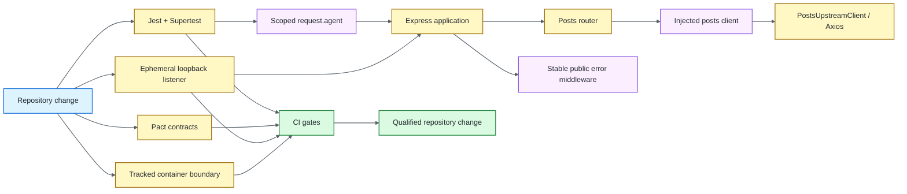

# Node.js / Supertest API Quality Engineering Framework

[](https://github.com/portyu9/qa-automation-node-supertest/actions/workflows/ci.yml)
[](https://github.com/portyu9/qa-automation-node-supertest/actions/workflows/extended.yml)
[](https://github.com/portyu9/qa-automation-node-supertest/actions/workflows/security.yml)
[](https://github.com/portyu9/qa-automation-node-supertest/actions/workflows/docs.yml)

[](https://nodejs.org/)
[](https://developer.mozilla.org/docs/Web/JavaScript)
[](https://expressjs.com/)
[](https://github.com/ladjs/supertest)
[](https://jestjs.io/)
[](https://docs.pact.io/)
[](https://github.com/features/actions)
[](https://trivy.dev/)
[](LICENSE)
[](.github/SECURITY.md)

A deterministic API quality-engineering framework built with **Express, Supertest, Jest, Axios, and Pact**. Component tests execute the real Express app in-process; transport policy is isolated behind a provider-neutral client; Pact owns consumer compatibility; a loopback listener proves real TCP/serialization behavior; and native Supertest agents/expectations remain available for stateful protocol contracts.

> [!IMPORTANT]
> Application behavior, in-process HTTP semantics, outbound transport, contract compatibility, real-listener behavior, packaged runtime, and deployed integration are deliberately separate failure domains.

**Start here:** [capabilities](#capabilities) · [architecture](#architecture) · [quick start](#quick-start) · [repository map](#repository-map) · [documentation](#documentation)

## Capabilities

| Plane | Purpose | Primary evidence |
| --- | --- | --- |
| Component | Express routing, validation, middleware, stable error envelopes | Jest + coverage |
| Stateful protocol | Cookies, query/body/header composition, redirects, HEAD/OPTIONS | Native Supertest assertions |
| Transport | Target, timeout, correlation, failure normalization | Deterministic Axios-boundary tests |
| Contract | Consumer/provider HTTP expectations | Pact interactions/artifacts |
| Listener | Real Node TCP, middleware, serialization, correlation | Loopback smoke evidence |
| Packaged runtime | Governed container build + test entrypoint | Container execution result |
| Security | SAST, advisories, repository/image risk, dependency-diff risk | CodeQL, npm Audit, Trivy, Dependency Review |
| Documentation | README/workflow/governance consistency | Documentation contract status |

## Architecture



Tests own **application/protocol intent**; injected clients own **dependency seams**; transport code owns **Axios policy**; Pact owns **consumer compatibility**; the listener/container lanes own their runtime boundaries. See [`docs/ARCHITECTURE.md`](docs/ARCHITECTURE.md) for the full dependency model.

## Quick start

```bash
npm ci --ignore-scripts
npm run check
npm run test:coverage
```

Exercise the real listener without an external dependency:

```bash
npm run test:live-smoke
```

Start the real service only with an explicitly approved upstream:

```bash
UPSTREAM_BASE_URL=https://api.test.example.internal npm start
```

For the complete command reference, runtime variables, native Supertest surface, failure taxonomy, request correlation, evidence, dependency maintenance, and triage, see [`docs/OPERATIONS.md`](docs/OPERATIONS.md).

## Repository map

```text
.
├── .github/
├── docs/
├── scripts/
└── src/
```

## Engineering contracts

- **In-process first:** ordinary API behavior uses `createApp({ postsClient })` + Supertest; no listener or public dependency is required.
- **Native state ownership:** `request.agent(app)` is scoped to the scenario that needs cookies/session continuity rather than shared globally.
- **Dependency isolation:** routes depend on a narrow provider-neutral client, never Axios directly.
- **Explicit runtime ownership:** `UPSTREAM_BASE_URL` is required for real server startup; there is no public fallback.
- **Stable public errors:** transport implementation details normalize into deliberate API error codes/statuses.
- **Correlation discipline:** run identity and per-request identity remain bounded and distinct.
- **Cheapest sufficient boundary:** use Supertest, transport tests, Pact, loopback sockets, containers, or deployed integration only when that boundary adds required semantics.
- **Semantic evidence:** CI validates that tests/interactions/listener work actually executed rather than accepting artifact presence alone.

## Stable CI conclusions

| Stable status | Responsibility |
| --- | --- |
| `ci-gate` | Component/transport/Pact/listener/package evidence needed for the primary quality conclusion |
| `extended-gate` | Runtime/integration compatibility breadth |
| `security-gate` | CodeQL, npm Audit, repository/image Trivy, and Dependency Review when available |

Workflow definitions: [`ci.yml`](.github/workflows/ci.yml) · [`extended.yml`](.github/workflows/extended.yml) · [`security.yml`](.github/workflows/security.yml) · [`docs.yml`](.github/workflows/docs.yml).

## Documentation

| Guide | Use it for |
| --- | --- |
| [`docs/README.md`](docs/README.md) | Documentation index |
| [`docs/ARCHITECTURE.md`](docs/ARCHITECTURE.md) | Composition, configuration, correlation, Supertest state, transport, errors, Pact, listener, container boundaries |
| [`docs/TEST_STRATEGY.md`](docs/TEST_STRATEGY.md) | Risk-based test-layer selection and exit criteria |
| [`docs/OPERATIONS.md`](docs/OPERATIONS.md) | Commands, runtime inputs, native protocol contracts, correlation, evidence, dependencies, triage |
| [`docs/DEPENDENCY_BOUNDARIES.md`](docs/DEPENDENCY_BOUNDARIES.md) | Component, transport, contract, listener, and live-integration dependency ownership |
| [`docs/DEPENDENCY_GOVERNANCE.md`](docs/DEPENDENCY_GOVERNANCE.md) | Dependency qualification and control-plane governance |

The deeper protocol, failure-taxonomy, correlation, evidence, and dependency detail lives in `/docs`; the main README intentionally retains only the architecture overview above.

## Design principle

A strong Supertest framework makes the failed boundary obvious: **application behavior, stateful in-process HTTP semantics, input policy, transport normalization, compatibility, listener runtime, packaged runtime, or explicit external dependency**.
