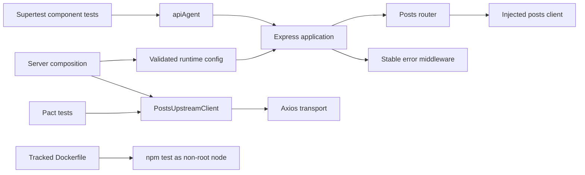

# Architecture

## Design objective

The framework separates HTTP application behavior from outbound dependency transport. Supertest exercises Express in-process; the upstream client owns Axios configuration; Pact owns consumer interaction contracts; the tracked container owns one packaged execution path. Each boundary can fail independently and should produce an attributable signal.

## Composition and dependency injection

`createApp({ postsClient, config })` is the composition seam for deterministic component tests. Tests inject a client double at the application-facing dependency boundary; they do not mock Express internals or open a TCP listener. When a client is injected, application construction does not read runtime environment configuration.

`src/server.js` owns production/server composition. It loads validated runtime configuration and then constructs the provider-neutral `PostsUpstreamClient`. This keeps target selection at the executable boundary rather than hiding a provider choice inside reusable application or client code.

## Configuration boundary

`src/config.js` validates runtime inputs before server startup. `loadConfig(env)` accepts an injected read-only environment map for deterministic configuration contracts and defaults to `process.env` only at the real runtime boundary.

`UPSTREAM_BASE_URL` is required. It must be an absolute HTTP(S) URL with a hostname and without credentials, query strings, or fragments. Optional path prefixes remain valid. Request timeout and port values must be positive integers.

Supplied `TEST_RUN_ID` values are normalized through the shared correlation-token policy and limited to 1–128 ASCII letters, digits, dots, underscores, colons, or hyphens. Missing run identity receives a generated UUID.

There is no public-provider fallback. Missing upstream ownership is a configuration error before the server binds a port or Axios opens transport.

The framework does not encode credentials in upstream URLs. Authentication, if added later, belongs in a controlled transport-header/interceptor policy.

## Request and run correlation

`requestContext` establishes one request ID for each inbound request and returns it in `x-request-id` as well as stable JSON error envelopes. Unsafe or oversized inbound request IDs are replaced by a bounded generated UUID.

`apiAgent()` deliberately separates the two correlation dimensions:

- `x-test-run-id` carries the validated run token shared across requests from the same test execution;
- `x-request-id` is a fresh UUID per HTTP exchange.

This prevents a long run ID plus UUID suffix from violating the request-ID length contract and being silently replaced by middleware. Request IDs identify one exchange; run IDs group a test execution.

## Stateful Supertest boundary

`src/testing/apiAgent.js` owns a scoped `request.agent(app)` so cookie persistence is explicit and local to the helper instance. It exposes generic verb dispatch plus ordinary verb helpers without hiding native Supertest chaining.

`src/testing/expectations.js` contains reusable `.expect(fn)` contracts for JSON responses, headers, and body predicates. Capability tests prove that the helper still composes with native Supertest features:

- query parameters;
- JSON request bodies;
- request/response headers;
- cookie persistence;
- redirect following;
- `HEAD` and `OPTIONS`;
- custom expectation callbacks.

A shared process-global agent is intentionally avoided because it would make cookies and other transport state leak across tests.

## Upstream transport boundary

`PostsUpstreamClient` owns:

- validation of explicitly supplied upstream base URLs;
- bounded Axios timeout;
- mapping logical operations to resource paths;
- normalization of raw transport failures into `UpstreamServiceError`.

Routes consume client methods, not Axios objects. This keeps route tests independent of DNS/network availability and gives transport tests a small surface to verify.

## Stable failure taxonomy

The client/error middleware exposes a deliberate public taxonomy:

| Internal class | HTTP status | Public error code |
| --- | ---: | --- |
| Upstream timeout (`ECONNABORTED`, `ETIMEDOUT`) | 504 | `upstream_timeout` |
| Other upstream transport failure | 502 | `upstream_unavailable` |
| Unexpected application failure | 500 | `internal_server_error` |

The original cause remains available internally through the error cause chain. Public responses do not expose dependency exception messages, stack traces, URLs, or credentials.

Safe error logs contain only allowlisted fields such as request ID, error class, stable public code, and status. Request bodies and authorization headers are intentionally excluded.

## Input validation

Route parameters are validated before the upstream client is called. Invalid post identifiers return a stable 400 envelope and never consume dependency capacity.

Validation belongs at the boundary that owns the input. A transport client should not be required to understand Express path strings.

## Contract boundary

Pact tests execute the real provider-neutral consumer client against Pact's generated provider substitute. They verify HTTP expectations without contacting a live external provider.

Pact does not replace component tests: component tests validate Express routing/envelopes, while Pact validates the consumer's outbound interaction contract.

## Server lifecycle

`src/server.js` is the real TCP-hosting edge. It is the only ordinary path that requires an external upstream target. Most tests call `createApp()` with an injected client rather than spawning the server. This avoids fixed-port conflicts, public-network coupling, slow startup, and open-handle leaks in the ordinary test suite.

Graceful SIGTERM/SIGINT behavior belongs to the server lifecycle, not route tests.

## Packaged execution boundary

The root `Dockerfile` is a tracked test/runtime packaging contract, not an unverified deployment decoration.

- the base Node image is maintained through a dedicated Docker Dependabot block;
- CI builds the tracked Dockerfile and executes its existing `npm test` entrypoint;
- the image remains non-root (`USER node`);
- the working directory is explicitly owned by `node` so Pact can create test evidence without elevated permissions;
- `.dockerignore` excludes `.git`, CI metadata, local dependencies, reports, Pact output, environment files, logs, and editor state from the build context.

This ensures local untracked material cannot be copied into the image merely because `Dockerfile` uses `COPY . .`.

## Extension rules

New behavior should preserve these boundaries:

- require explicit external-target ownership before server startup;
- validate runtime configuration and correlation tokens before transport or listener side effects;
- inject external dependencies at client/domain seams;
- test routes in-process with Supertest;
- keep run correlation distinct from per-request identity;
- keep stateful `request.agent` instances scoped rather than global;
- normalize transport implementation details before they reach public error responses;
- keep public error codes/statuses stable and documented;
- avoid logging bodies, auth headers, or raw dependency messages;
- keep container build context minimized and the packaged test path non-root;
- add a deterministic test for every new failure classification;
- use Pact only for consumer/provider expectations, not as a substitute for component behavior tests.
