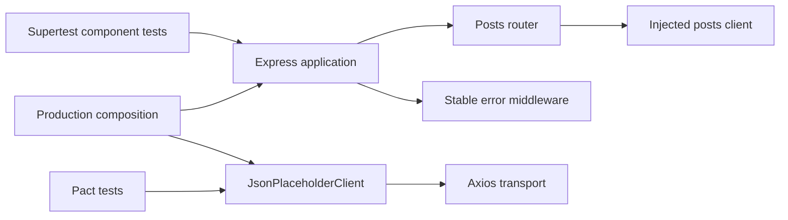

# Architecture

## Design objective

The framework separates HTTP application behavior from outbound dependency transport. Supertest exercises Express in-process; the upstream client owns Axios configuration; Pact owns consumer interaction contracts. Each boundary can fail independently and should produce an attributable signal.

## Composition and dependency injection

`createApp({ postsClient, config })` is the composition seam for deterministic component tests. Tests inject a client double at the application-facing dependency boundary; they do not mock Express internals or open a TCP listener.

Production composition constructs `JsonPlaceholderClient` from validated configuration. This preserves one application pipeline while allowing transport and route semantics to be tested separately.

## Configuration boundary

`src/config.js` validates process inputs before server startup.

`UPSTREAM_BASE_URL` must be an absolute HTTP(S) URL without credentials, query strings, or fragments. Optional path prefixes remain valid. Request timeout and port values must be positive integers. Run IDs are generated when not explicitly supplied.

The framework does not encode credentials in upstream URLs. Authentication, if added later, belongs in a controlled transport-header/interceptor policy.

## Request correlation

`requestContext` establishes one request ID for each inbound request and returns it in `x-request-id` as well as stable JSON error envelopes. Test helpers can inject a run correlation header independently.

Request IDs are useful for one HTTP exchange; run IDs group a test execution. Do not collapse them into a single identifier because they have different cardinality and ownership.

## Upstream transport boundary

`JsonPlaceholderClient` owns:

- upstream base URL;
- bounded Axios timeout;
- mapping logical operations to resource paths;
- normalization of raw transport failures into `UpstreamServiceError`.

Routes consume client methods, not Axios objects. This keeps route tests independent of DNS/network availability and gives transport tests a small surface to verify.

## Stable failure taxonomy

The client/error middleware exposes a deliberate public taxonomy:

| Internal class | HTTP status | Public error code |
| --- | ---: | --- |
| Upstream timeout (`ECONNABORTED`, `ETIMEDOUT`) | 504 | `upstream_timeout` |
| Other upstream transport failure | 502 | `upstream_unavailable` |
| Unexpected application failure | 500 | `internal_server_error` |

The original cause remains available internally through the error cause chain. Public responses do not expose dependency exception messages, stack traces, URLs, or credentials.

Safe error logs contain only allowlisted fields such as request ID, error class, stable public code, and status. Request bodies and authorization headers are intentionally excluded.

## Input validation

Route parameters are validated before the upstream client is called. Invalid post identifiers return a stable 400 envelope and never consume dependency capacity.

Validation belongs at the boundary that owns the input. A transport client should not be required to understand Express path strings.

## Contract boundary

Pact tests execute the real consumer client against Pact's generated provider substitute. They verify HTTP expectations without contacting the live external provider.

Pact does not replace component tests: component tests validate Express routing/envelopes, while Pact validates the consumer's outbound interaction contract.

## Server lifecycle

`src/server.js` is the real TCP-hosting edge. Most tests import the application directly rather than spawning the server. This avoids fixed-port conflicts, slow startup, and open-handle leaks in the ordinary test suite.

Graceful SIGTERM/SIGINT behavior belongs to the server lifecycle, not route tests.

## Extension rules

New behavior should preserve these boundaries:

- validate runtime configuration before server startup;
- inject external dependencies at client/domain seams;
- test routes in-process with Supertest;
- normalize transport implementation details before they reach public error responses;
- keep public error codes/statuses stable and documented;
- avoid logging bodies, auth headers, or raw dependency messages;
- add a deterministic test for every new failure classification;
- use Pact only for consumer/provider expectations, not as a substitute for component behavior tests.
